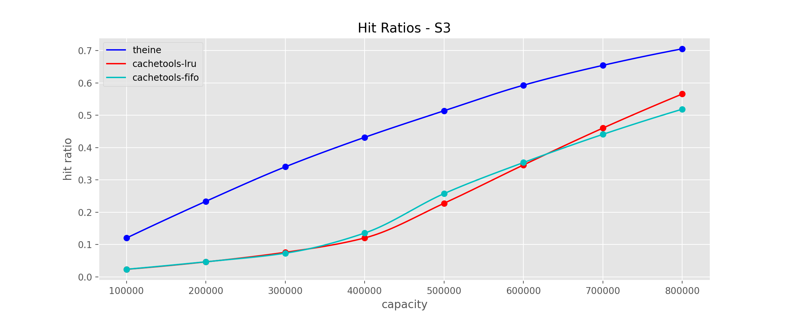

# Theine
High performance in-memory cache inspired by [Caffeine](https://github.com/ben-manes/caffeine).

- High performance [Rust core](https://github.com/Yiling-J/theine-core)
- High hit ratio with [W-TinyLFU eviction policy](https://arxiv.org/pdf/1512.00727.pdf)
- Expired data are removed automatically using [hierarchical timer wheel](http://www.cs.columbia.edu/~nahum/w6998/papers/ton97-timing-wheels.pdf)

  > TTL must be considered in in-memory caching because
it limits the effective (unexpired) working set size. Efficiently removing expired objects from cache needs to be
prioritized over cache eviction. - [A large scale analysis of hundreds of in-memory
cache clusters at Twitter](https://www.usenix.org/system/files/osdi20-yang.pdf)
- Simple API
- Django cache backend

## Table of Contents

- [Requirements](#requirements)
- [Installation](#installation)
- [API](#api)
- [Decorator](#decorator)
- [Django Cache Backend](#django-cache-backend)
- [Benchmarks(WIP)](#benchmarks)
  * [continuous benchmark](#continuous-benchmark)
  * [10k requests](#10k-requests)
  * [hit ratios](#hit-ratios)

## Requirements
Python 3.7+

## Installation
```
pip install theine
```

## API

Key should be a **str**, and value can be any **Python object**.

```Python
from theine import Cache
from datetime import timedelta

cache = Cache("tlfu", 10000)
# without default, return None on miss
v = cache.get("key")

# with default, return default on miss
sentinel = object()
v = cache.get("key", sentinel)

# set with ttl
cache.set("key", {"foo": "bar"}, timedelta(seconds=100))

# delete from cache
cache.delete("key")
```

## Decorator
Theine support string keys only, so to use a decorator, a function to convert input signatures to string is necessary. **The recommended way is specifying the function explicitly**, this is approach 1, Theine also support generating key automatically, this is approach 2. I will list pros and cons below.

**- explicit key function**

```python
from theine import Cache, Memoize
from datetime import timedelta

@Memoize(Cache("tlfu", 10000), timedelta(seconds=100))
def foo(a:int) -> int:
    return a

@foo.key
def _(a:int) -> str:
    return f"a:{a}"

foo(1)

# asyncio
@Memoize(Cache("tlfu", 10000), timedelta(seconds=100))
async def foo_a(a:int) -> int:
    return a

@foo_a.key
def _(a:int) -> str:
    return f"a:{a}"

await foo_a(1)

```

**Pros**
- A decorator with both sync and async support, you can replace your lru_cache with Theine now.
- Thundering herd protection(multithreading: set `lock=True` in `Memoize`, asyncio: always enabled).
- Type checked. Mypy can check key function to make sure it has same input signature as original function and return a string.

**Cons**
- You have to use 2 functions.
- Performance. Theine API: around 8ms/10k requests ->> decorator: around 12ms/10k requests.

**- auto key function**

```python
from theine import Cache, Memoize
from datetime import timedelta

@Memoize(Cache("tlfu", 10000), timedelta(seconds=100), typed=True)
def foo(a:int) -> int:
    return a

foo(1)

# asyncio
@Memoize(Cache("tlfu", 10000), timedelta(seconds=100), typed=True)
async def foo_a(a:int) -> int:
    return a

await foo_a(1)

```
**Pros**
- Same as explicit key version.
- No extra key function.

**Cons**
- Worse performance: around 18ms/10k requests.
- Auto removal of stale keys is disabled due to current implementation.
- Unexpected memory usage. The auto key function use same methods as Python's lru_cache. Take a look [this issue](https://github.com/python/cpython/issues/88476) or [this one](https://github.com/python/cpython/issues/64058).


## Django Cache Backend

```Python
CACHES = {
    "default": {
        "BACKEND": "theine.adapters.django.Cache",
        "TIMEOUT": 300,
        "OPTIONS": {"MAX_ENTRIES": 10000},
    },
}
```

## Benchmarks
### continuous benchmark
https://github.com/Yiling-J/cacheme-benchmark

### 10k requests
Cachetools: https://github.com/tkem/cachetools

Source Code: https://github.com/Yiling-J/theine/blob/main/benchmarks/benchmark_test.py

Write and Mix Zipf use 1k max cache size, so you can see the high cost of traditional LFU eviction policy here.

|                                        | Read     | Write     | Mix Zipf  |
|----------------------------------------|----------|-----------|-----------|
| Theine(W-TinyLFU) API                  | 6.34 ms  | 22.40 ms  |           |
| Theine(W-TinyLFU) Auto-Key Decorator   | 16.10 ms | 35.15 ms  | 24.30 ms  |
| Theine(W-TinyLFU) Custom-Key Decorator | 12.94 ms | 25.60 ms  | 18.08 ms  |
| Cachetools LFU Decorator               | 15.70 ms | 627.10 ms | 191.04 ms |

### hit ratios

All hit ratio benchmarks use small datasets and finish in seconds/minutes, better to try Theine yourself and focus on whether the cache exceeds your performance needs and has the desired capabilities. You may also notice that in ucb bench, LRU has a higher hit ratio. Take a look this: [cache performing worse than LRU](https://github.com/ben-manes/caffeine/issues/106) if you are interested.

Source Code: https://github.com/Yiling-J/theine/blob/main/benchmarks/trace_bench.py

**zipf**


**search**

This trace is described as "disk read accesses initiated by a large commercial search engine in response to various web search requests."

**database**

This trace is described as "a database server running at a commercial site running an ERP application on top of a commercial database."

**UC Berkeley web traces**

This trace consists of 2 days' worth of HTTP traces gathered from the Home IP service offered by UC Berkeley to its students.

