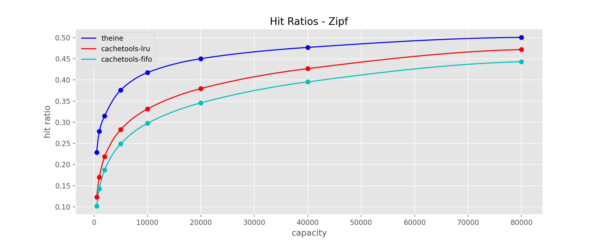

# Theine
High performance in-memory cache inspired by [Caffeine](https://github.com/ben-manes/caffeine).

- High performance [Rust core](https://github.com/Yiling-J/theine-core)
- High hit ratio with [W-TinyLFU](https://arxiv.org/pdf/1512.00727.pdf) or [Clock-Pro](https://static.usenix.org/event/usenix05/tech/general/full_papers/jiang/jiang_html/html.html) eviction policy
- Expired data are removed automatically using [hierarchical timer wheel](http://www.cs.columbia.edu/~nahum/w6998/papers/ton97-timing-wheels.pdf)

  > TTL must be considered in in-memory caching because
it limits the effective (unexpired) working set size. Efficiently removing expired objects from cache needs to be
prioritized over cache eviction. - [A large scale analysis of hundreds of in-memory
cache clusters at Twitter](https://www.usenix.org/system/files/osdi20-yang.pdf)
- Simple API
- Django cache backend

## Table of Contents

- [Requirements](#requirements)
- [Installation](#installation)
- [Cache Eviction Policies](#cache-eviction-policies)
- [API](#api)
- [Decorator](#decorator)
- [Django Cache Backend](#django-cache-backend)
- [Metadata Memory Overhead](#metadata-memory-overhead)
- [Benchmarks](#benchmarks)
  * [continuous benchmark](#continuous-benchmark)
  * [10k requests](#10k-requests)
  * [hit ratios](#hit-ratios)
- [Support](#support)

## Requirements
Python 3.7+

## Installation
```
pip install theine
```

## Cache Eviction Policies

Theine provides 3 built in cache eviction policies:

#### LRU

Discards the least recently used items first.

#### W-TinyLFU

An approximate LFU policy in order to boost the effectiveness of caches subject to skewed access distributions.

Theine uses an adaptive version of W-TinyLFU to get better hit ratio under different types of workloads.

Reference:

https://arxiv.org/pdf/1512.00727.pdf


#### Clock-PRO

An improved CLOCK replacement policy(CLOCK: an approximation of LRU), based on [PyClockPro](https://bitbucket.org/SamiLehtinen/pyclockpro/src/master/).

Reference:

https://static.usenix.org/event/usenix05/tech/general/full_papers/jiang/jiang_html/html.html


## API

Key should be a **Hashable** object, and value can be any **Python object**. If key type is not **str/int**, Theine will generate a unique key string automatically, this unique str will use extra space in memory and increase get/set/remove overhead.

Each Cache instance will span a thread to evict expired entries proactively, and the overhead of cache instance init is relatively high. So **don't create instance dynamically in your function**. Django adapter will create a global cache instance autmoatically, and when using the `Memoize` decorator, please make sure your cache instance is created globally, instead of creating a new one in each run.

Please be aware the Cache class is **not** thread-safe.

```Python
from theine import Cache
from datetime import timedelta

# tlfu is the eviction policy, Theine provide 3 policies lru/tlfu/clockpro
cache = Cache("tlfu", 10000)
# without default, return None on miss
v = cache.get("key")

# with default, return default on miss
sentinel = object()
v = cache.get("key", sentinel)

# set with ttl
cache.set("key", {"foo": "bar"}, timedelta(seconds=100))

# delete from cache
cache.delete("key")

# close cache, stop timing wheel thread
cache.close()

# clear cache
cache.clear()

# get current cache stats, please call stats() again if you need updated stats
stats = cache.stats()
print(stats.request_count, stats.hit_count, stats.hit_rate)

# get cache max size
cache.max_size

# get cache current size
len(cache)

```

## Decorator
Theine support hashable keys, so to use a decorator, a function to convert input signatures to hashable is necessary. **The recommended way is specifying the function explicitly**, this is approach 1, Theine also support generating key automatically, this is approach 2. Same as Theine API, if key function return type is not **str/int**, Theine will generate a unique key string automatically, this unique str will use extra space in memory and increase get/set/remove overhead.

**- explicit key function**

```python
from theine import Cache, Memoize
from datetime import timedelta

@Memoize(Cache("tlfu", 10000), timedelta(seconds=100))
def foo(a:int) -> int:
    return a

@foo.key
def _(a:int) -> str:
    return f"a:{a}"

foo(1)

# asyncio
@Memoize(Cache("tlfu", 10000), timedelta(seconds=100))
async def foo_a(a:int) -> int:
    return a

@foo_a.key
def _(a:int) -> str:
    return f"a:{a}"

await foo_a(1)

```

**Pros**
- Both sync and async support.
- Explicitly control how key is generated. Most remote cache(redis, memcached...) only allow string keys, return a string in key function make it easier when you want to use remote cache later.
- Thundering herd protection(multithreading: set `lock=True` in `Memoize`, asyncio: always enabled).
- Type checked. Mypy can check key function to make sure it has same input signature as original function and return a hashable.

**Cons**
- You have to use 2 functions.
- Performance. Theine API: around 8ms/10k requests ->> decorator: around 12ms/10k requests.

**- auto key function**

```python
from theine import Cache, Memoize
from datetime import timedelta

@Memoize(Cache("tlfu", 10000), timedelta(seconds=100), typed=True)
def foo(a:int) -> int:
    return a

foo(1)

# asyncio
@Memoize(Cache("tlfu", 10000), timedelta(seconds=100), typed=True)
async def foo_a(a:int) -> int:
    return a

await foo_a(1)

```
**Pros**
- Same as explicit key version.
- No extra key function.

**Cons**
- Worse performance: around 18ms/10k requests.
- Unexpected memory usage. The auto key function use same methods as Python's lru_cache. Take a look [this issue](https://github.com/python/cpython/issues/88476) or [this one](https://github.com/python/cpython/issues/64058).


## Django Cache Backend

```Python
CACHES = {
    "default": {
        "BACKEND": "theine.adapters.django.Cache",
        "TIMEOUT": 300,
        "OPTIONS": {"MAX_ENTRIES": 10000, "POLICY": "tlfu"},
    },
}
```

## Metadata Memory Overhead
Assume your key is 24 bytes long, then each meta key entry in Rust is 92 bytes. For 1 million keys, the total memory overhead is 92 megabytes. Clock-Pro will use **2x** meta space, which is 184 megabytes.

## Benchmarks

Python version: 3.11

OS: Ubuntu 22.04.2 LTS

### continuous benchmark
https://github.com/Yiling-J/cacheme-benchmark

### 10k requests
Cachetools: https://github.com/tkem/cachetools

Cacheout: https://github.com/dgilland/cacheout

Source Code: https://github.com/Yiling-J/theine/blob/main/benchmarks/benchmark_test.py

Write and Mix Zipf use 1k max cache size, so you can see the high cost of traditional LFU eviction policy here.

|                                        | Read     | Write     | Mix Zipf  |
|----------------------------------------|----------|-----------|-----------|
| Theine(Clock-Pro) API                  | 3.07 ms  | 9.86 ms   |           |
| Theine(W-TinyLFU) API                  | 3.42 ms  | 10.14 ms  |           |
| Theine(W-TinyLFU) Auto-Key Decorator   | 7.17 ms  | 18.41 ms  | 13.18 ms  |
| Theine(W-TinyLFU) Custom-Key Decorator | 6.45 ms  | 17.67 ms  | 11.50 ms  |
| Cachetools LFU Decorator               | 15.70 ms | 627.10 ms | 191.04 ms |
| Cacheout LFU Decorator                 | 50.05 ms | 704.70 ms | 250.95 ms |
| Theine(LRU) Custom-Key Decorator       | 5.70 ms  | 16.04 ms  | 10.91 ms  |
| Cachetools LRU Decorator               | 14.05 ms | 61.06 ms  | 36.89 ms  |
| Cacheout LRU Decorator                 | 47.90 ms | 94.94 ms  | 68.25 ms  |

### hit ratios

All hit ratio benchmarks use small datasets and finish in seconds/minutes, better to try Theine yourself and focus on whether the cache exceeds your performance needs and has the desired capabilities.

Source Code: https://github.com/Yiling-J/theine/blob/main/benchmarks/trace_bench.py

**zipf**


**search**

This trace is described as "disk read accesses initiated by a large commercial search engine in response to various web search requests."

**database**

This trace is described as "a database server running at a commercial site running an ERP application on top of a commercial database."

**Scarabresearch database trace**

Scarabresearch 1 hour database trace from this [issue](https://github.com/ben-manes/caffeine/issues/106)

**Meta anonymized trace**

Meta shared anonymized trace captured from large scale production cache services, from [cachelib](https://cachelib.org/docs/Cache_Library_User_Guides/Cachebench_FB_HW_eval/#running-cachebench-with-the-trace-workload)


## Support
Open an issue, ask question in discussions or join discord channel: https://discord.gg/StrgfPaQqE

Theine Go version is also available, which focus on concurrency performance, take a look if you are interested: [Theine Go](https://github.com/Yiling-J/theine-go).
