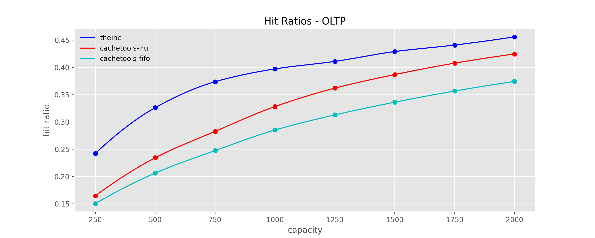

# Theine

High performance in-memory cache inspired by [Caffeine](https://github.com/ben-manes/caffeine).

- High performance [Rust core](https://github.com/Yiling-J/theine-core)
- High hit ratio with adaptive [W-TinyLFU](https://arxiv.org/pdf/1512.00727.pdf) eviction policy
- Expired data are removed automatically using [hierarchical timer wheel](http://www.cs.columbia.edu/~nahum/w6998/papers/ton97-timing-wheels.pdf)
- Fully typed
- Thread safe
- Django cache backend

## Theine V2 Migration Guide

Theine V2 is a major refactor and rewrite of V1, focused on thread safety and scalability. Below are the key changes in V2:

#### Cache Class and Memoize Decorator
- In V2, the `Cache` class and `Memoize` decorator now accept capacity as the first parameter. We have simplified the design by consolidating to a single policy: adaptive W-Tinylfu.

**Old:**
```python
cache = Cache("tlfu", 10000)

@Memoize(Cache("tlfu", 10000), timedelta(seconds=100))
...
```

**New:**
```python
cache = Cache(10000)

@Memoize(10000, timedelta(seconds=100))
...
```

#### Renaming `timeout` to `ttl`
- The `timeout` parameter in the `Cache` class’s `set` method has been renamed to `ttl` (Time-to-Live). This is more commonly used in caching and is clearer in meaning. In V1, the term `timeout` was used for consistency with Django, but `ttl` is now the preferred naming convention in V2. The Django adapter settings still uses `TIMEOUT` for compatibility.

**Old:**
```python
# No change needed here
cache.set("key", {"foo": "bar"}, timedelta(seconds=100))

@Memoize(Cache("tlfu", 10000), timedelta(seconds=100))
...

# These will change in V2
cache.set("key", {"foo": "bar"}, timeout=timedelta(seconds=100))

@Memoize(Cache("tlfu", 10000), timeout=timedelta(seconds=100))
...
```

**New:**
```python
cache.set("key", {"foo": "bar"}, timedelta(seconds=100))

@Memoize(Cache("tlfu", 10000), timedelta(seconds=100))

cache.set("key", {"foo": "bar"}, ttl=timedelta(seconds=100))

@Memoize(Cache("tlfu", 10000), ttl=timedelta(seconds=100))
```

#### Thread Safety by Default
- In V2, both the `Cache` class and the `Memoize` decorator are thread-safe by default. However, if you're not using Theine in a multi-threaded environment, you can disable the locking mechanism:
```python
cache = Cache(10000, nolock=True)

@Memoize(10000, timedelta(seconds=100), nolock=True)
...
```

#### Single Expiration Handling Thread for All Cache Instances
- In V2, instead of each cache instance using a separate thread for proactive expiration (as in V1), a single thread will be used to handle expirations for all cache instances via `asyncio`. This improves efficiency and scalability.

## Table of Contents

- [Requirements](#requirements)
- [Installation](#installation)
- [API](#api)
- [Metadata Memory Overhead](#metadata-memory-overhead)
- [Benchmarks](#benchmarks)
  * [throughput](#throughput)
  * [hit ratios](#hit-ratios)
- [Secondary Cache(Experimental)](#secondary-cacheexperimental)
- [Support](#support)

## Requirements
Python 3.7+

## Installation
```
pip install theine
```

## API (V2)

Key should be a **Hashable** object, and value can be any **Python object**.

#### Cache Client

```Python
from theine import Cache
from datetime import timedelta

# tlfu is the eviction policy, Theine provide 3 policies lru/tlfu/clockpro
cache = Cache(10000)
# without default, return None on miss
v = cache.get("key")

# with default, return default on miss
sentinel = object()
v = cache.get("key", sentinel)

# set with ttl
cache.set("key", {"foo": "bar"}, timedelta(seconds=100))

# delete from cache
cache.delete("key")

# close cache, stop timing wheel thread
cache.close()

# clear cache
cache.clear()

# get current cache stats, please call stats() again if you need updated stats
stats = cache.stats()
print(stats.request_count, stats.hit_count, stats.hit_rate)

# get cache max size
cache.max_size

# get cache current size
len(cache)

```

#### Cache Decorator

Theine's Decorator is designed with following:

- Both sync and async support.
- Explicitly control how key is generated. Most remote cache(redis, memcached...) only allow string keys, return a string in key function make it easier when you want to use remote cache later.
- Thundering herd protection(multithreading: set `lock=True` in `Memoize`, asyncio: always enabled).
- Type checked. Mypy can check key function to make sure it has same input signature as original function and return a hashable.

Theine support hashable keys, so to use a decorator, a function to convert input signatures to hashable is necessary. **The recommended way is specifying the function explicitly**, this is approach 1, Theine also support generating key automatically, this is approach 2.

**- explicit key function**

```python
from theine import Cache, Memoize
from datetime import timedelta

@Memoize(10000, timedelta(seconds=100))
def foo(a:int) -> int:
    return a

@foo.key
def _(a:int) -> str:
    return f"a:{a}"

foo(1)

# asyncio
@Memoize(10000, timedelta(seconds=100))
async def foo_a(a:int) -> int:
    return a

@foo_a.key
def _(a:int) -> str:
    return f"a:{a}"

await foo_a(1)

```

**- auto key function**

```python
from theine import Cache, Memoize
from datetime import timedelta

@Memoize(10000, timedelta(seconds=100), typed=True)
def foo(a:int) -> int:
    return a

foo(1)

# asyncio
@Memoize(10000, timedelta(seconds=100), typed=True)
async def foo_a(a:int) -> int:
    return a

await foo_a(1)

```

**Important:** The auto key function use same methods as Python's lru_cache. And there are some issues relatedto the memory usage in this way, take a look [this issue](https://github.com/python/cpython/issues/88476) or [this one](https://github.com/python/cpython/issues/64058).


#### Django Cache Backend

```Python
CACHES = {
    "default": {
        "BACKEND": "theine.adapters.django.Cache",
        "TIMEOUT": 300,
        "OPTIONS": {"MAX_ENTRIES": 10000},
    },
}
```

## Core Metadata Memory Overhead
The Rust core uses only the key hash, so the actual key size does not affect memory usage. Each metadata entry in Rust consumes 64 bytes of memory.

## Benchmarks

### throughput

### hit ratios

**zipf**


**s3**


**ds1**


**oltp**


**wiki CDN**


**Twitter Cache**


## Support
Feel free to open an issue or ask question in discussions.
